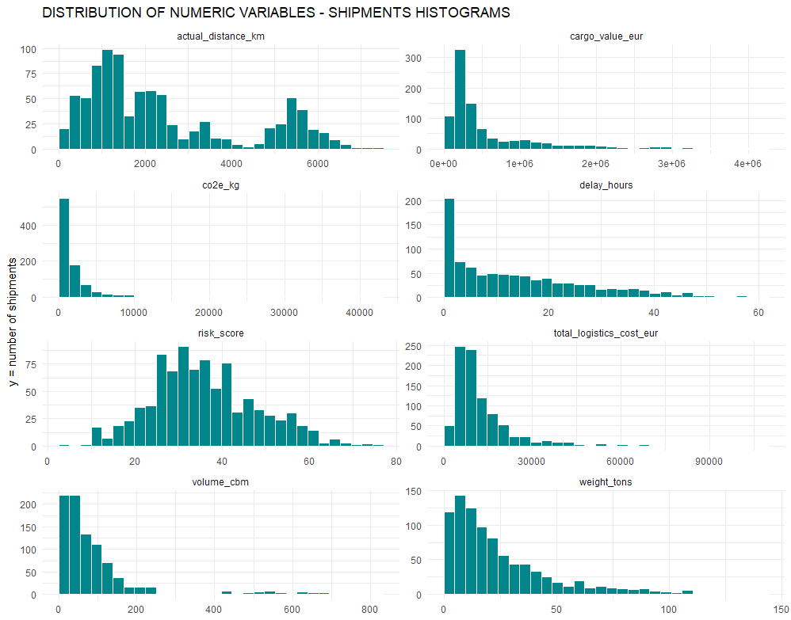
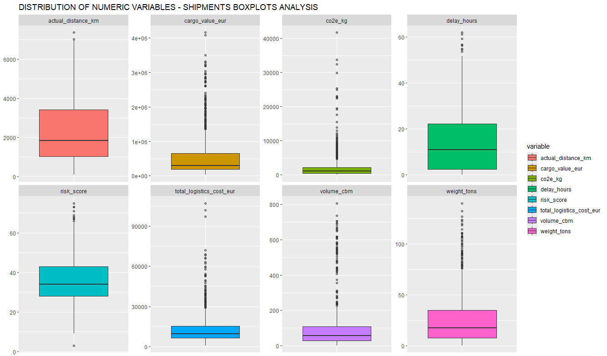
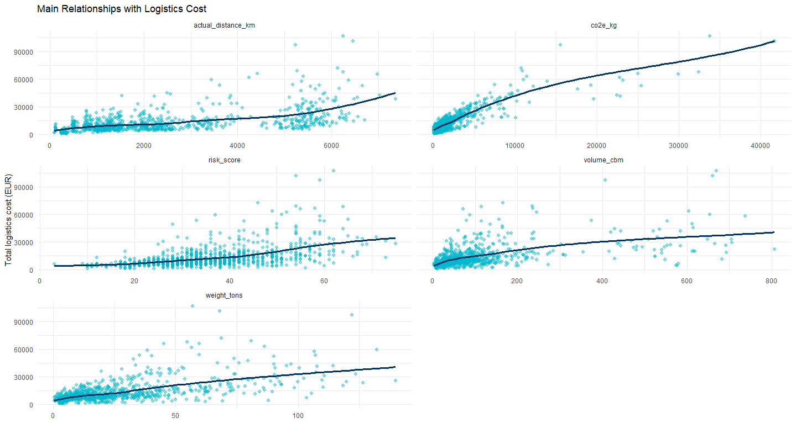
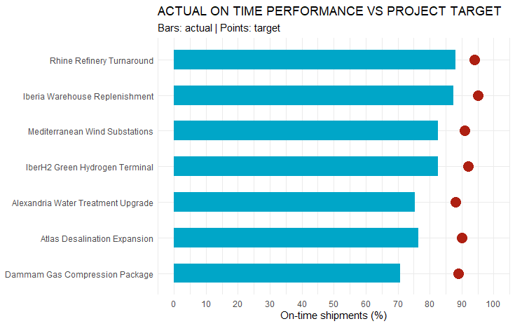
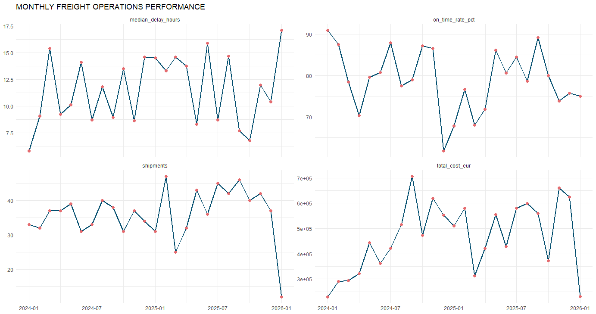
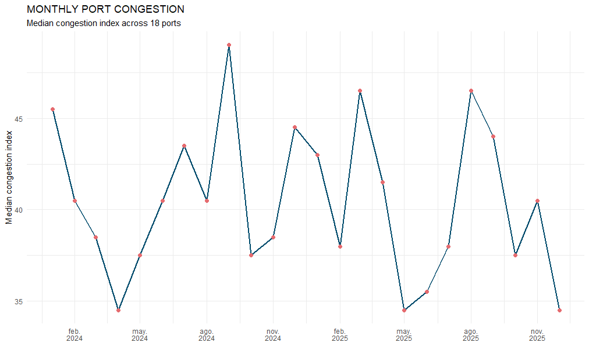
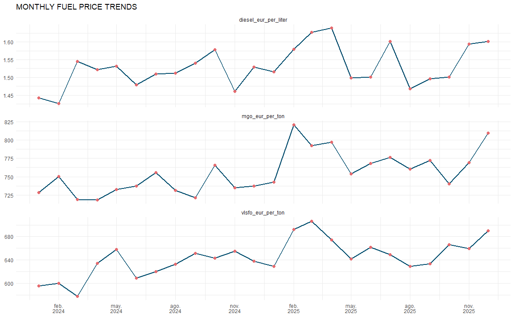

# Freight Operations Analysis

Proyecto personal de análisis de datos aplicado a operaciones de transporte de mercancías y logística de proyectos.

El objetivo es desarrollar un flujo de trabajo completo que combine:

- análisis exploratorio y descriptivo en **R**;
- visualización y dashboard en **Power BI**;
- análisis prescriptivo en **Python**;
- análisis geoespacial de rutas en **QGIS**.

> **Nota:** todos los datos son sintéticos y se utilizan exclusivamente con fines de aprendizaje y portfolio. No representan operaciones ni resultados reales de empresas, clientes, transportistas, puertos o proyectos.

## Objetivos

- Preparar y validar un modelo de datos de operaciones de transporte.
- Analizar puntualidad, retrasos, costes, incidencias, emisiones y rendimiento operativo.
- Explorar diferencias entre proyectos, modos de transporte, rutas, puertos, transportistas y tipos de carga.
- Construir visualizaciones, indicadores y herramientas de apoyo a la decisión.
- Mantener un proyecto reproducible, documentado y apto para portfolio.

## Herramientas

- **R / RStudio:** importación, calidad, limpieza, EDA y visualización.
- **Power BI:** modelado, medidas y dashboard.
- **Python:** optimización, simulación y análisis prescriptivo.
- **QGIS:** representación y análisis de nodos y rutas.
- **Git / GitHub:** control de versiones y publicación.

## Estructura del proyecto

```text
Freight_Operations_Analysis/
│
├── dashboard/
│   └── 2024-2025_Freight-Operations-Analysis.pbix
│       └── Modelo semántico y desarrollo del dashboard en Power BI.
│
├── data/
│   ├── external_sources/
│   │   └── Fuentes externas o datos auxiliares incorporados al proyecto.
│   ├── processed_data/
│   │   └── Datos limpios, transformados y preparados para el análisis.
│   └── raw_data/
│       └── Datos originales sin modificar.
│
├── docs/
│   ├── datasets_dictionary.xlsx
│   │   └── Diccionario de datos de los archivos y variables del proyecto.
│   ├── ideas_exploration.txt
│   │   └── Ideas, hipótesis y posibles líneas de análisis.
│   └── relationships.md
│       └── Descripción de las tablas, relaciones y modelo de datos propuesto.
│
├── output/
│   ├── figures/
│   │   ├── 04_EDA_hist.png
│   │   │   └── Histogramas de las principales variables numéricas.
│   │   ├── 04_EDA_boxplot.png
│   │   │   └── Boxplots y revisión visual de valores extremos.
│   │   ├── 04_EDA_scatterplot.png
│   │   │   └── Relaciones entre el coste logístico y variables operativas.
│   │   ├── 04_EDA_project-performance.png
│   │   │   └── Puntualidad real frente al objetivo por proyecto.
│   │   ├── 04_EDA_lineplot.png
│   │   │   └── Evolución mensual del rendimiento operativo.
│   │   ├── 04_EDA_lineplot_port_congestion.png
│   │   │   └── Evolución mensual de la congestión portuaria.
│   │   └── 04_EDA_lineplot_fuel_prices.png
│   │       └── Evolución mensual de los precios de combustible.
│   └── maps/
│       └── Mapas y resultados geoespaciales exportados.
│
├── python/
│   └── Scripts de Python y documentación específica del análisis prescriptivo.
│
├── qgis/
│   └── Archivos de proyecto, procesos, scripts y documentación del análisis geoespacial.
│
├── R/
│   ├── 01_Import.R
│   │   └── Importación automatizada y comprobación inicial de los archivos CSV.
│   ├── 02_Data_Quality.R
│   │   └── Diagnóstico estructural, relacional y lógico de los datos originales.
│   ├── 03_Data_Cleaning.R
│   │   └── Limpieza, preparación, validación y exportación de los datos procesados.
│   └── 04_EDA.R
│       └── Análisis exploratorio, descriptivo y visual de las operaciones.
│
├── .gitignore
│   └── Reglas para excluir del control de versiones archivos temporales,
│       locales o no necesarios.
│
├── Freight_Operations_Analysis.Rproj
│   └── Archivo de proyecto de RStudio.
│
└── README.md
    └── Descripción general, estado, metodología y próximos pasos del proyecto.
```

## Modelo de datos

El modelo se organiza alrededor de `fact_shipments`, con un registro por envío.

Tablas de detalle:

- `fact_route_legs`: tramos de cada envío.
- `fact_events`: hitos y eventos operativos.
- `fact_incidents`: incidencias asociadas a los envíos.
- `fact_port_congestion`: indicadores mensuales por puerto.
- `fact_fuel_prices`: indicadores mensuales de combustible.

Dimensiones:

- calendario;
- proyectos;
- instalaciones;
- puertos;
- transportistas;
- buques;
- tipos de carga.

Las relaciones están documentadas en [`docs/relationships.md`](docs/relationships.md).

## Desarrollo realizado

### 1. Importación de datos

**Script:** [`R/01_Import.R`](R/01_Import.R)

El script:

- localiza los CSV de `data/raw_data/`;
- construye rutas relativas con `here`;
- importa automáticamente los archivos con `read_csv`;
- guarda las 13 tablas en la lista nombrada `datasets`;
- revisa problemas de lectura y la estructura inicial de los datos.

Los archivos originales no se modifican.

### 2. Evaluación de calidad

**Script:** [`R/02_Data_Quality.R`](R/02_Data_Quality.R)

El script realiza un diagnóstico general antes de limpiar o transformar los datos.

Se revisan:

- problemas de importación;
- valores ausentes;
- cadenas vacías y espacios sobrantes;
- claves primarias;
- claves de negocio;
- claves foráneas e integridad referencial;
- variables binarias con valores `Y` y `N`;
- ausencias según el modo de transporte;
- continuidad y coherencia del calendario;
- reglas básicas de proyectos e instalaciones.

#### Resultados principales

- No se detectaron problemas de importación.
- Las claves primarias revisadas son completas y únicas.
- No se encontraron duplicados en las claves de negocio comprobadas.
- No se detectaron referencias huérfanas entre las tablas.
- No se encontraron problemas generales de formato en variables de texto.
- Las variables binarias revisadas contienen únicamente los valores esperados.
- La dimensión calendario contiene 731 fechas continuas entre 2024-01-01 y 2025-12-31.
- Las reglas básicas de fechas, porcentajes, prioridades, coordenadas y capacidades no mostraron errores.

#### Valores ausentes relevantes

En `fact_shipments` se identificaron:

- 132 `origin_port_id` ausentes;
- 132 `destination_port_id` ausentes;
- 311 `vessel_id` ausentes.

Interpretación:

- Los 132 envíos por carretera no requieren puertos ni buques. Son ausencias estructurales esperadas.
- Los 179 envíos intermodales no tienen `vessel_id`.
- Los 179 tramos `Container Sea` de esos envíos intermodales tampoco tienen buque asignado.

La ausencia de buque en las operaciones intermodales queda documentada como una limitación pendiente de revisión. No se realizará ninguna imputación sin una regla que la justifique.

#### Calendario ISO

La columna `week` utiliza numeración ISO.

Se detectaron cinco fechas de final de año en las que el año natural y el año ISO son diferentes. No son errores, pero será necesario utilizar conjuntamente `iso_year` e `iso_week` en los análisis semanales.

### 3. Limpieza y preparación de datos

**Script:** [`R/03_Data_Cleaning.R`](R/03_Data_Cleaning.R)

El script prepara los datos para las siguientes fases sin modificar los archivos originales. Para ello:

- vuelve a importar los datos mediante `R/01_Import.R`;
- crea `clean_datasets` como copia independiente de la lista original `datasets`;
- incorpora `iso_year` e `iso_year_week` a `dim_calendar` para permitir análisis semanales correctos;
- convierte las variables binarias de `Y` y `N` a valores lógicos `TRUE` y `FALSE`;
- conserva sin imputar los valores ausentes estructurales o no justificables;
- valida que no se hayan añadido ni eliminado filas;
- comprueba que el único cambio estructural sea la incorporación de dos columnas a `dim_calendar`;
- exporta las 13 tablas limpias a `data/processed_data/` y verifica que todos los archivos se hayan generado.

#### Resultados principales

- Las 731 fechas de `dim_calendar` tienen un `iso_year` y un `iso_year_week` válidos, sin valores ausentes ni cálculos incorrectos.
- Las 14 variables binarias revisadas se convirtieron correctamente a tipo lógico, manteniendo los mismos recuentos y valores ausentes.
- Las 13 tablas conservaron exactamente el mismo número de filas que los datos originales.
- `dim_calendar` incorporó únicamente las dos columnas previstas; no se produjeron otros cambios estructurales.
- La validación estructural final fue correcta y se exportaron los 13 archivos CSV esperados.

### 4. Análisis exploratorio de datos

**Script:** [`R/04_EDA.R`](R/04_EDA.R)

El análisis exploratorio utiliza las 13 tablas limpias almacenadas en `data/processed_data/` y mantiene separadas las distintas unidades de análisis:

- un registro por envío en `fact_shipments`;
- un registro por tramo en `fact_route_legs`;
- un registro por evento en `fact_events`;
- un registro por incidencia en `fact_incidents`;
- un registro por puerto y mes en `fact_port_congestion`;
- un registro por mes en `fact_fuel_prices`.

El script:

- crea tablas analíticas enriquecidas mediante uniones con las dimensiones;
- resume el volumen y el rendimiento general de las operaciones;
- estudia distribuciones numéricas, asimetrías y posibles valores atípicos;
- analiza relaciones mediante correlaciones de Spearman;
- compara puntualidad, retrasos, costes, daños y emisiones por proyecto, modo, transportista, familia de carga, nivel de riesgo y nivel de servicio;
- analiza incidencias, causas raíz, gravedad, localización, costes y reclamaciones;
- revisa la estructura y el rendimiento de los tramos de ruta;
- estudia la cobertura y el estado de los eventos operativos;
- analiza congestión portuaria, huelgas y evolución mensual;
- compara precios de combustible con los recargos aplicados;
- descompone el coste logístico total;
- compara la intensidad de emisiones por tonelada-kilómetro.

El script se ejecutó completo desde una sesión limpia sin errores. Los avisos obtenidos se deben únicamente a que algunos paquetes fueron compilados con una versión de R ligeramente posterior.

#### Datos preparados para Power BI

No es necesario exportar desde `R/04_EDA.R` las tablas resumen ni las tablas enriquecidas creadas durante el EDA.

Las 13 tablas limpias ya fueron exportadas por `R/03_Data_Cleaning.R` a:

```text
data/processed_data/
```

Estas tablas serán la fuente principal para las siguientes fases del proyecto. Las tablas agregadas del EDA se mantienen como resultados analíticos y de validación, pero no se utilizarán como sustituto del modelo relacional.

## Principales hallazgos del EDA

### Operaciones generales

- Se analizaron 900 envíos correspondientes a 7 proyectos, 11 transportistas utilizados y 10 tipos de carga.
- El volumen acumulado fue de 23.085 toneladas y 2.184.346 kilómetros.
- El coste logístico total fue de 11.665.158 €, con un coste medio aproximado de 12.961 € por envío.
- La tasa global de puntualidad fue del 79,3 %.
- Se registraron 186 entregas fuera de plazo y una tasa de daños del 4,11 %.
- Las principales variables económicas, físicas y ambientales presentan distribuciones asimétricas, por lo que se priorizaron medianas para realizar comparaciones entre grupos.

### Costes y rendimiento

- El coste logístico muestra sus relaciones más fuertes con las emisiones absolutas, el peso, el volumen, el nivel de riesgo y la distancia.
- El transporte marítimo Breakbulk representa 470 envíos y concentra operaciones de mayor peso, coste y complejidad.
- El transporte por carretera presenta la mejor puntualidad, pero también la mayor intensidad de emisiones por tonelada-kilómetro.
- Ninguno de los siete proyectos alcanza su objetivo de puntualidad.
- Dammam presenta la mayor desviación respecto a su objetivo, con una diferencia de -18,17 puntos porcentuales.
- Las comparaciones entre transportistas deben realizarse dentro de modos equivalentes, ya que varios modos están asociados a un único transportista.
- El nivel de servicio `Standard` obtiene la mejor puntualidad, mientras que `Critical` presenta el mayor coste mediano y la menor puntualidad. Este resultado debe interpretarse como una posible concentración de operaciones más complejas y urgentes, no como un efecto causal del nivel de servicio.

### Carga, riesgo y emisiones

- La carga sobredimensionada se asocia con un mayor coste mediano y una menor puntualidad.
- Las operaciones heavy lift presentan costes claramente superiores y una mayor exposición a daños.
- Los envíos de riesgo medio muestran peor puntualidad y mayores retrasos que los de riesgo bajo.
- La categoría de riesgo alto solo contiene un envío y no permite extraer conclusiones generales.
- La intensidad mediana de emisiones es mayor en carretera: 0,095 kg CO₂e por tonelada-kilómetro.
- `Container Sea` registra la menor intensidad mediana: 0,0215 kg CO₂e por tonelada-kilómetro.

### Incidencias

- Se registraron 55 incidencias, equivalentes al 6,11 % de los envíos.
- El 69,1 % de las incidencias se clasificó como prevenible.
- Las incidencias generaron 692 horas de retraso, 271.966 € de coste directo y 61.575 € en reclamaciones.
- Los retrasos y los problemas de aduanas o documentación son los tipos más frecuentes.
- `Customs hold`, `Carrier capacity`, `Road permit delay` y `Port congestion` son causas operativas prioritarias.
- Las incidencias en proyecto presentan el mayor retraso mediano y el mayor importe acumulado de reclamaciones.
- Las incidencias en puerto tienen la mayor proporción prevenible.

### Tramos y eventos

- Los 900 envíos disponen de tramos de ruta, con 2.436 tramos en total y una mediana de 3 tramos por envío.
- El modo `Road` aparece en todos los envíos como tramo inicial, final o recorrido completo.
- `Customs hold` y `Carrier capacity` concentran el mayor impacto temporal entre las causas específicas de retraso de los tramos.
- El valor `None` en `delay_reason` no implica necesariamente ausencia de retraso; puede representar una causa no registrada.
- Se analizaron 5.772 eventos operativos, con una media de 6,41 eventos por envío.
- Los eventos portuarios aparecen en el 85,3 % de los envíos y no aplican a los 132 envíos realizados únicamente por carretera.
- Los 186 eventos clasificados como retrasados corresponden exclusivamente a `Delivery completed` y se asignan al transportista. Esta estructura limita la atribución detallada de responsabilidad en hitos intermedios.

### Puertos y combustible

- La tabla de congestión forma un panel completo de 18 puertos durante 24 meses.
- La mediana global del índice de congestión es 40, la espera mediana de buques es de 9,2 horas y la utilización mediana de atraques es del 70,1 %.
- Casablanca, Alexandria y Dammam presentan los niveles habituales de congestión más elevados.
- El índice de congestión mantiene una relación fuerte con la utilización de atraques y con las horas de espera de los buques.
- Solo existen cuatro registros puerto-mes con huelga, por lo que sus diferencias deben interpretarse con cautela.
- La evolución mensual de la congestión fluctúa sin una tendencia sostenida ni una estacionalidad clara.
- El recargo de combustible muestra una relación positiva moderada con el precio del diésel en carretera y con el MGO en operaciones marítimas.
- La relación entre el recargo marítimo y el VLSFO es débil.

### Composición del coste

- Flete: 75,30 %.
- Costes portuarios: 10,80 %.
- Recargo de combustible: 8,42 %.
- Costes aduaneros: 5,52 %.

## Visualizaciones generadas

Las visualizaciones creadas durante el EDA se encuentran en `output/figures/`.

### Distribución de variables numéricas



### Identificación visual de valores extremos



### Relaciones con el coste logístico



### Puntualidad por proyecto



### Evolución mensual del rendimiento operativo



### Evolución de la congestión portuaria



### Evolución de los precios de combustible



## Modelado en Power BI

### 5. Preparación y modelado del modelo semántico

**Archivo:** [`dashboard/2024-2025_Freight-Operations-Analysis.pbix`](dashboard/2024-2025_Freight-Operations-Analysis.pbix)

Tras completar la preparación y el EDA en R, se inició el desarrollo del modelo semántico en Power BI utilizando las tablas procesadas como fuente. La `dim_calendar` generada durante la fase de R no se incorporó al modelo de Power BI; en su lugar, se creó una nueva tabla calculada `dim_calendar` para cubrir de forma continua todo el horizonte operativo entre 2023-01-01 y 2026-12-31. La tabla se marcó como tabla de fechas e incluye atributos de año, trimestre, mes, día de la semana y calendario ISO.

El modelo de Power BI contiene actualmente 16 tablas:

- tablas de hechos: `fact_shipments`, `fact_route_legs`, `fact_events`, `fact_incidents`, `fact_port_congestion` y `fact_fuel_prices`;
- dimensiones principales: `dim_projects`, `dim_facilities`, `dim_ports` y `dim_cargo_types`;
- dimensiones de rol para transportistas: `dim_primary_carriers` y `dim_leg_carriers`;
- dimensiones de rol para buques: `dim_primary_vessels` y `dim_leg_vessels`;
- dimensión temporal: `dim_calendar`;
- tabla `Medidas`, destinada a centralizar las medidas DAX del dashboard.

El desdoblamiento de transportistas y buques permite distinguir el transportista o buque principal del envío de los asignados a cada tramo y evita caminos de filtrado ambiguos entre `fact_shipments` y `fact_route_legs`.

#### Relaciones del modelo

El modelado sigue principalmente relaciones **uno a varios (1:*)** con dirección de filtro única desde las dimensiones hacia las tablas de hechos.

Se establecieron como relaciones principales:

- `dim_projects` y `dim_cargo_types` con `fact_shipments`;
- `dim_primary_carriers` y `dim_primary_vessels` con `fact_shipments`;
- `dim_leg_carriers` y `dim_leg_vessels` con `fact_route_legs`;
- `fact_shipments` con `fact_route_legs`, `fact_events` y `fact_incidents` mediante `shipment_id`;
- `dim_ports` con `fact_port_congestion`;
- `dim_calendar` con las tablas que requieren análisis temporal.

Cuando una misma dimensión puede representar varios roles, se mantiene una única relación activa por ruta de filtrado y las alternativas se conservan inactivas. En particular:

- las relaciones de destino de instalaciones y puertos se utilizan como relaciones principales y las correspondientes relaciones de origen se mantienen inactivas;
- `actual_delivery_date` se utiliza como relación temporal principal de `fact_shipments`;
- las demás fechas del ciclo del envío se mantienen disponibles para análisis específicos mediante relaciones inactivas y `USERELATIONSHIP()`;
- las fechas alternativas de eventos, incidencias y tramos se mantienen controladas para evitar crear rutas activas paralelas a través de `fact_shipments`;
- `month_start` permite relacionar `fact_port_congestion` y `fact_fuel_prices` con la dimensión calendario a su granularidad mensual.

#### Simplificación de la capa semántica

Para mejorar la claridad del panel de campos y reducir errores durante la construcción de visuales:

- se ocultan claves primarias y foráneas de uso exclusivamente técnico cuando existe un atributo descriptivo equivalente;
- las fechas utilizadas para relaciones se mantienen en las tablas de hechos, pero el calendario se utiliza como referencia temporal para ejes, filtros y segmentadores;
- se ocultan columnas auxiliares de ordenación de `dim_calendar`;
- las coordenadas y geometrías destinadas principalmente a QGIS no se exponen como campos de uso habitual en el dashboard;
- se mantienen visibles los identificadores y atributos con utilidad operativa, como `shipment_id`, así como las variables necesarias para analizar costes, puntualidad, retrasos, riesgo, incidencias y emisiones.

#### Estado de esta fase

La estructura del modelo semántico, la dimensión calendario, las dimensiones de rol y las relaciones principales están preparadas. La página inicial `Freight Operations Control Tower` está creada y el siguiente bloque de trabajo corresponde a la construcción y validación de medidas DAX y al desarrollo de los visuales del dashboard.

## Aspectos pendientes de revisión

- Confirmar la interpretación de los buques ausentes en operaciones intermodales.
- Mantener los `NA` estructurales de los envíos por carretera.
- Mantener la cobertura temporal 2023-2026 de `dim_calendar` si se incorporan nuevas fuentes o se amplía el horizonte de datos.
- Confirmar la granularidad de las claves de negocio con el diccionario de datos.
- Revisar en QGIS la coherencia entre coordenadas, ciudades y países.
- Mantener cautela al interpretar categorías con pocos registros, especialmente el nivel de riesgo alto, las huelgas y algunos modos con bajo volumen mensual.
- Tratar los valores `None` de las causas como ausencia de una causa específica registrada, no necesariamente como ausencia de retraso.
- Revisar la interpretación operativa del nivel de servicio `Critical`, que presenta mayor coste y menor puntualidad.
- Evitar atribuir causalidad a las relaciones observadas durante el EDA.

## Próximos pasos

- Crear y organizar las medidas DAX necesarias en la tabla `Medidas`.
- Desarrollar las páginas y visualizaciones del dashboard `Freight Operations Control Tower`.
- Validar que los principales KPIs y resultados obtenidos en Power BI coincidan con los resultados del EDA en R.
- Revisar el comportamiento de las relaciones inactivas mediante medidas con `USERELATIONSHIP()` cuando sean necesarias.
- Desarrollar el análisis prescriptivo y de optimización en Python.
- Representar y analizar nodos, puertos y rutas en QGIS.
- Incorporar progresivamente nuevos resultados, conclusiones y visualizaciones a la documentación del proyecto.

## Estado del proyecto

- [x] Estructura inicial.
- [x] Modelo de datos preliminar.
- [x] Importación automatizada.
- [x] Evaluación inicial de calidad.
- [x] Limpieza y preparación.
- [x] Análisis exploratorio en R.
- [x] Modelado semántico en Power BI.
- [ ] Medidas DAX y dashboard en Power BI.
- [ ] Análisis prescriptivo en Python.
- [ ] Análisis geoespacial en QGIS.
